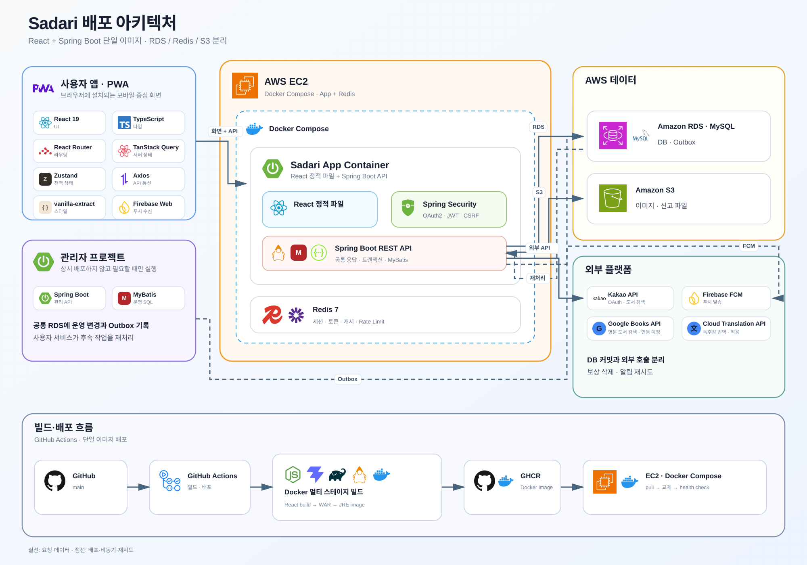

# Sadari

> 독서의 즐거움에 오르다

[](https://github.com/hwaiplay/sadari/actions/workflows/ci-cd.yml)


Sadari는 독서 기록, 목표, 소셜 활동과 독서 모임을 연결한 React PWA 기반 독서 플랫폼입니다. 인증 수명주기, 데이터 정합성, 동시성, 파일 보안과 운영 자동화까지 실제 서비스 문제를 중심으로 설계했습니다.

## 프로젝트 정보

| 항목 | 내용 |
| --- | --- |
| 개발 기간 | 2026.03 ~ 진행 중 |
| 개발 형태 | 2인 팀 프로젝트 |
| 서비스 구성 | 사용자 React PWA, Spring Boot API, 별도 관리자 서비스 |
| 주요 기여 영역 | 다중 기기 인증·세션, S3 파일 저장, 사용자·관리자 연동, 성능 측정과 문서화 |
| 배포 구성 | GitHub Actions, GHCR, EC2, Docker Compose |

## 기술 스택

| 구분 | 기술 |
| --- | --- |
| Backend | Java 17, Spring Boot 4.0.3, Spring MVC, Spring Security, MyBatis 4.0.1 |
| Data | MySQL 8.4, Redis 7, HikariCP |
| Auth | Kakao OAuth 2.0, JJWT 0.13, HttpOnly Cookie, CSRF Token, Redis Lua Script |
| Frontend | React 19.2, TypeScript 5.9, Vite 7.3, TanStack Query 5, Zustand 5 |
| Messaging | Firebase Admin SDK, Firebase Cloud Messaging, PWA Push Subscription |
| Storage | Local File Storage, AWS SDK for Java 2.x, Private S3 |
| Delivery | Gradle, Multi-stage Docker, GitHub Actions, GHCR, EC2, Docker Compose |

## 핵심 성과

| 해결 과제 | 적용 내용 | 결과 |
| --- | --- | --- |
| 마이페이지 반복 조회 | 기간별 집계와 목록 쿼리 통합 | SQL 호출 최대 `19회 → 2회` |
| 다중 기기 인증 | JWT `sid`와 Redis 기기별 세션, Refresh Token 회전 | 현재·전체 기기 로그아웃과 세션 단위 폐기 지원 |
| 외부 API 쿼터 보호 | 50권 선조회, Redis Lua 회원 제한, 10분 공용 캐시와 앱 전체 호출 예산 | 50권 조회 기준 카카오 호출 최대 `5회 → 1회`, 단일 회원의 쿼터 독점 차단 |
| 외부 시스템 정합성 | DB 커밋 이후 FCM 발송·기존 파일 삭제, 롤백 시 신규 파일 보상 삭제 | DB·푸시·파일 간 불일치 가능성 축소 |
| 관리자 상태 동기화 | DB Outbox와 사용자 백엔드 재시도 소비 | Redis 장애 시 이벤트를 보존하고 다음 실행에서 재처리 |
| 독서 모임 동시성 | `SELECT ... FOR UPDATE`와 예약 좌석 계산 | 가입·초대·승인 경쟁 시 정원 초과 방지 |
| 이미지 보안 | 시그니처·디코더·해상도 검증, EXIF 보정과 재인코딩 | 확장자 위장과 메타데이터 기반 위험 차단 |

## 주요 기능

| 영역 | 사용자 기능 | 주요 구현 |
| --- | --- | --- |
| 도서 | 기간별 인기 도서와 Kakao 도서 검색 및 표지 색상 탐색 | [고유 작성자 기준 인기 순위, 50권 선조회·10권 분할 표시와 Redis 쿼터 보호](docs/technical-review/book-search-and-ranking.md) |
| 독서 기록 | 읽기 상태, 별점, 독후감, 기간별 독서량 | [도서·독후감 원자적 등록, 상태별 저장 정책과 편집 충돌 감지](docs/technical-review/reading-report-transaction.md) |
| 독서 목표 | 주간·월간·연간 목표와 달성 현황 | [ISO 기간 경계, 이전 목표 복사와 조건부 집계](docs/technical-review/reading-goal-aggregation.md) |
| 소셜 | 프로필, 팔로우, 좋아요와 댓글 | [본인·타인 공개 범위 분리, 대상 유형 검증과 차단 관계](docs/technical-review/social-feed-reactions.md) |
| 독서 모임 | 모임 생성, 가입 신청, 초대와 승인 | [모임장 권한, 정원 행 잠금, 초대 예약 좌석과 만료 정책](docs/technical-review/reading-club-concurrency.md) |
| 알림 | 서비스 알림과 PWA 웹 푸시 | [언어별 템플릿 치환, 업무별 중복 방지와 커밋 이후 FCM 발송](docs/technical-review/notification-push-transaction.md) |
| 계정 | 로그인, 기기별 로그아웃, 비활성화와 탈퇴 예약 | [JWT 세션 식별자, Redis 토큰 회전과 30일 삭제 유예](docs/technical-review/authentication-session-lifecycle.md) |
| 콘텐츠 안전 | 비속어 입력 차단과 이미지 업로드 검증 | [Aho-Corasick 사전 탐지, 이미지 재인코딩과 비공개 저장](docs/technical-review/content-validation-file-security.md) |
| 다국어·번역 | 한국어·영어 UI와 공개 독후감 번역 보기 | [기기 언어 기본값, DB 문구 다국어 처리, Google 번역 캐시와 월 50만 자 제한](docs/technical-review/multilingual-translation-cache.md) |

## 시스템 구성

[](docs/architecture/assets/sadari-architecture-overview.svg)

외부 플랫폼 중 Google Cloud Translation API는 공개 독후감의 요청 시점 번역과 캐시에 사용합니다. Google Books API는 영문 도서 검색과 영문 도서 정보 제공을 위한 다음 연동 대상으로 표시했습니다.

[전체 데이터베이스 ERD](docs/architecture/database-erd/README.md)에서 현재 DDL 기준 테이블·컬럼·관계와 영역별 구조를 확인할 수 있습니다.

사용자 서비스와 관리자 서비스는 동기 REST 호출 대신 공통 MySQL 업무 테이블과 파일 저장소를 사용합니다. 이 구조의 스키마 결합은 다음 기준으로 통제합니다.

- 사용자 저장소의 `scripts/db/mysql/01-create.sql`을 스키마 원본으로 관리합니다.
- 관리자 메뉴·공통 코드 등 기준 데이터는 `scripts/db/mysql/output/02-admin-insert.sql`에서 관리합니다.
- 테이블별 쓰기 주체를 구분하고, 사용자 세션 변경은 DB Outbox를 거쳐 사용자 백엔드만 Redis에 반영합니다.
- 서비스 규모가 커져 독립 배포와 스키마 변경이 빈번해지면 운영 도메인별 API 또는 이벤트 계약으로 분리할 수 있습니다.

## 핵심 기술 사례

### 1. 반복 SQL을 집계 쿼리로 통합

마이페이지의 기간별 독서량·목표·달성 횟수와 도서 목록에 실행되던 최대 19회의 SQL을 2회로 줄였습니다. 완료 독후감은 조건부 집계하고, 현재 읽는 책과 완료 목록은 한 번 조회한 뒤 애플리케이션에서 기간별로 분류합니다.

| 지표 | 개선 전 | 개선 후 |
| --- | ---: | ---: |
| SQL 호출 | 최대 19회 | 2회 |
| 개발 DB JDBC 중앙값 | 215.241ms | 26.436ms |
| 개발 DB JDBC P95 | 578.272ms | 80.201ms |
| 격리 DB 10,000건 중앙값 | 314.315ms | 175.091ms |

개발 DB는 준비 10회 후 100회, 격리 MySQL은 준비 5회 후 30회 반복한 단일 연결 JDBC 측정값입니다. Spring MVC·MyBatis·직렬화와 동시 요청을 포함한 API 응답 시간은 아니므로 운영 성능으로 일반화하지 않았습니다.

격리 MySQL 8.4.10에서는 더미 독후감 수를 늘리며 기존·통합 쿼리를 번갈아 실행했습니다. 최근 5년 목표 329건과 `DONE 90% / READ 10%` 분포를 사용하고, 모든 결과 행을 소비해 결과 동등성도 검증했습니다.

| 더미 독후감 | 기존 중앙값 | 개선 중앙값 | 감소율 | 개선 배수 | 기존 / 개선 P95 |
| ---: | ---: | ---: | ---: | ---: | ---: |
| 100건 | 14.953ms | 5.664ms | 62.12% | 2.64배 | 21.242ms / 7.233ms |
| 1,000건 | 34.558ms | 16.296ms | 52.85% | 2.12배 | 39.175ms / 18.138ms |
| 10,000건 | 314.315ms | 175.091ms | 44.29% | 1.80배 | 435.453ms / 269.750ms |

개발 DB에서는 네트워크 왕복 감소가 가장 큰 개선 요인이었고, 데이터가 커질수록 CTE와 집계 비용이 상대적으로 커졌습니다. 호출 수 감소와 대량 집계 비용의 변화까지 함께 기록했습니다.

- [성능 개선 과정과 측정 조건](docs/performance/my-page-reading-summary-optimization.md)
- [집계 SQL](src/main/java/org/our/sadari/report/mapper/ReportMapper.xml)

### 2. JWT를 Redis 세션 수명주기와 결합

Kakao OAuth 로그인 후 기기별 `sid`를 포함한 Access Token과 Refresh Token을 HttpOnly Cookie로 발급합니다. Redis의 `auth:session:{sid}` Hash와 회원별 `sid` Set으로 각 기기의 Refresh Token을 독립 관리합니다.

- `JwtFilter`가 JWT 서명·만료뿐 아니라 Redis의 활성 `sid`와 계정 상태를 함께 검증합니다.
- 한 탭의 중복 Refresh 요청은 Promise를 공유하고, 여러 탭·서비스워커의 동시 재발급은 Redis Lua 회전과 유예시간으로 수렴시킵니다.
- 상태 변경 요청은 CSRF Token을 `X-XSRF-TOKEN` Header로 검증하고 불일치 시 한 번만 갱신·재시도합니다.
- 현재 기기 로그아웃은 해당 `sid`만 제거하고 전체 로그아웃은 회원의 모든 세션과 푸시 구독을 비활성화합니다.
- Access Token을 즉시 폐기해야 하는 상황에는 `jti`를 남은 만료시간 동안 블랙리스트에 저장합니다.
- 계정 상태 캐시가 없으면 DB에서 복원하되, Redis 장애나 캐시 누락이 정지·탈퇴 계정을 허용하지 않도록 실패 방향을 구분했습니다.
- `BroadcastChannel`과 storage 이벤트로 탭 간 로그아웃을 전파해 만료된 인증 화면이 남지 않게 합니다.

- [인증과 보안 설계](docs/portfolio/auth-security.md)
- [Redis 세션 관리](src/main/java/org/our/sadari/global/security/jwt/TokenRedisService.java)
- [인증 요청 필터](src/main/java/org/our/sadari/global/security/jwt/JwtFilter.java)

### 3. DB와 외부 시스템의 완료 시점 분리

DB 트랜잭션 안에서 파일 저장과 푸시 발송까지 성공한 것으로 간주하지 않습니다.

- 알림 데이터가 커밋된 뒤에만 FCM 푸시를 발송합니다.
- DB가 새 파일을 참조한 뒤 기존 물리 파일을 삭제합니다.
- DB가 롤백되면 요청 중 생성한 새 파일을 보상 삭제합니다.
- 도서 마스터가 없을 때 도서와 독후감 등록을 하나의 트랜잭션으로 처리합니다.

이를 통해 푸시·알림 불일치, 롤백된 DB의 삭제 파일 참조와 도서만 남는 부분 저장을 줄였습니다.

- [알림 서비스](src/main/java/org/our/sadari/alim/service/AlimServiceImpl.java)
- [파일 서비스](src/main/java/org/our/sadari/global/file/service/FileService.java)
- [독후감 서비스](src/main/java/org/our/sadari/report/service/ReportServiceImpl.java)

### 4. DB Outbox로 관리자 변경을 사용자 세션에 전달

관리자가 사용자를 정지·해제하면 DB 원본과 이력을 같은 트랜잭션에서 변경하고 `USER_STATUS_CHANGED` 이벤트를 `TB_EVTBOX`에 저장합니다. 사용자 백엔드는 처리 시점의 최신 DB 상태로 Redis를 갱신합니다.

한 이벤트가 실패해도 다음 사용자를 처리하고, Redis 반영에 성공한 이벤트만 삭제합니다. 연속된 정지·해제에서도 오래된 이벤트가 최신 상태를 덮어쓰지 않으며 실패 이벤트는 다음 실행에서 재시도됩니다.

[](docs/diagrams/user-status-outbox.svg)

- [사용자·관리자 연동 설계](docs/portfolio/admin-user-integration.md)
- [Outbox 소비 서비스](src/main/java/org/our/sadari/global/scheduler/service/UserStatusEventServiceImpl.java)

### 5. 독서 모임 좌석 경쟁을 행 잠금으로 직렬화

독서 모임 가입·초대·승인은 화면의 여석을 신뢰하지 않고 모임 행을 잠근 뒤 최신 좌석을 계산합니다. 만료되지 않은 초대는 예약 좌석으로 포함하고, 초대 수락은 같은 멤버 행을 `ACTIVE`로 전환합니다. 서로 다른 가입 경로의 정원 판정을 잠금 이후로 통일하고 중복 가입과 모임장 권한도 서버에서 검증해 오래된 화면·동시 요청의 우회를 막습니다.

- [독서 모임 설계](docs/architecture/reading-club-design.md)
- [독서 모임 서비스](src/main/java/org/our/sadari/readingClub/service/ReadingClubServiceImpl.java)

### 6. 이미지 업로드를 신뢰 경계 안에서 재구성

이미지 업로드는 확장자와 브라우저 Content-Type을 신뢰하지 않고 다음 순서로 처리합니다.

1. JPEG·PNG 파일 시그니처를 확인합니다.
2. 실제 디코딩 형식과 요청 형식이 일치하는지 검증합니다.
3. 파일 크기, 가로·세로 해상도와 전체 픽셀 수를 제한합니다.
4. EXIF 방향을 반영하되 불필요한 메타데이터는 유지하지 않습니다.
5. 서버가 새 이미지로 재인코딩하여 원본 바이트를 그대로 배포하지 않습니다.
6. UUID 기반 객체 키로 Private 저장소에 보관하고 허용된 경로만 조회합니다.

고해상도 프로필 원본은 브라우저 상태나 영구 저장소에 먼저 넣지 않습니다. 서버가 임시 업로드 토큰으로 비공개 공간에 최대 30분 보관하고 브라우저에는 축소 미리보기만 반환하며, 최종 저장·로그아웃·비활성화 시 임시 파일을 정리해 중단된 작성 흐름이 남지 않게 합니다.

- [콘텐츠·파일 보안 정책](docs/policies/content-file-policy.md)

### 7. 외부 API 쿼터를 Redis 방어 계층으로 보호

카카오 도서 검색은 반환 권수가 아니라 요청 횟수로 일일 쿼터가 차감됩니다. 서버가 최대 50권을 선조회하고 프론트엔드가 10권씩 표시해, 50권 확인에 필요한 호출을 최대 5회에서 1회로 줄였습니다.

검색 전에는 `TM_REPORT`의 도서별 고유 작성자 수를 집계한 주간·월간·연간 인기 도서 10권과 평균 평점을 표시합니다. 회원·독서 상태와 공개 여부는 순위 조건에서 제외하며, 직접 검색 결과에는 같은 카드 UI에서 기간·순위·평점 대신 출판사와 도서 소개를 표시합니다.

쿼터 효율화만으로는 악성 반복 요청을 막을 수 없어 Redis에 세 단계의 보호 경계를 구성했습니다.

- 인증된 회원만 검색 API를 호출하고 클라이언트가 전달한 식별값 대신 인증 Principal을 사용합니다.
- 회원별 60초·24시간 카운터는 Lua Script에서 함께 검사하고 증가시켜 다중 인스턴스에서도 제한을 우회할 수 없게 했습니다.
- 동일 검색어와 페이지는 SHA-256 해시 키로 10분간 캐시해 반복 검색을 외부 호출 없이 처리합니다.
- 캐시 미스에서만 앱 전체 실제 호출 예산을 차감하고, 일일 30,000건 중 기본 3,000건을 비상 여유로 남깁니다.
- Redis 장애 시 검색을 차단해 외부 쿼터의 무방비 소모를 막습니다.
- 회원 비활성화와 탈퇴 신청으로 카운터가 초기화되지 않으며 물리 삭제 시에만 회원별 제한 키를 정리합니다.

`5회 → 1회`는 요청당 10권과 50권의 소스 호출 구조로 계산한 값이며 응답 시간 실측 결과는 아닙니다.

- [도서 검색 쿼터 보호 정책](docs/policies/book-search-policy.md)
- [도서 검색 보호 서비스](src/main/java/org/our/sadari/book/service/BookSearchProtectionService.java)

## 추가 설계 사례

### 서비스 문제에 맞춘 탐색 알고리즘

비속어 필터는 입력마다 전체 사전을 순회하지 않고 Aho-Corasick 자동자로 한 번의 문자열 순회에서 후보를 찾습니다. 활성 사전은 10분간 캐시하고 이중 확인 잠금으로 한 요청만 재구성하며, 공백·기호·반복 문자 정규화와 허용 단어 예외를 함께 판정합니다.

표지 색상 탐색은 RGB 거리 대신 CIELAB 색차를 사용합니다. 외부 도서 이미지의 색을 제한된 공통 색상 집합에 매핑해 일관된 결과를 제공합니다.

- [성능과 알고리즘 설계](docs/portfolio/performance-algorithms.md)

### 프론트엔드 실패를 한 번의 복구 흐름으로 수렴

API 응답은 HTTP 상태와 업무 결과 코드를 함께 사용하고, Axios 계층에서 60초 타임아웃·CSRF 갱신·Refresh Token 재발급을 공통 처리합니다. 재시도는 각각 한 번으로 제한해 무한 요청을 막고, 같은 쓰기 요청에는 operation ID를 유지해 중복 결과를 방지합니다.

화면 전환이 중요한 작업은 차단 모달과 history guard를 사용합니다. Service Worker와 FCM 초기화에는 시간 제한을 두어 푸시 실패가 로그인이나 핵심 화면을 막지 않도록 분리했습니다.

### 계정 상태별 접근·보존·복구 범위를 분리

계정 상태는 단순한 로그인 허용 여부가 아니라 데이터 공개와 복구 가능 범위를 결정합니다.

| 상태 | 접근과 데이터 처리 |
| --- | --- |
| `WITHDRAWN` | 접근을 제한하고 독후감 공개, 댓글, 알림, 푸시 구독 등 비활성화 과정에서 중지된 항목은 재로그인 후에도 자동 복원하지 않습니다. |
| `DELETE_PENDING` | 기본 30일 유예기간 동안 접근을 제한하며 본인 재인증으로 삭제 예약을 취소할 수 있습니다. |
| 물리 삭제 완료 | 계정과 삭제 대상 데이터를 복구하지 않으며, 보존 의무가 있는 운영 이력은 식별자를 제거해 유지합니다. |

Kakao 연결 해제는 Redis의 10분 만료 `state`로 재인증 요청을 검증합니다. 실패 시 내부 상태를 먼저 변경하지 않고 `UNLINK_PENDING`으로 남겨 외부 계정은 연결된 채 사용자만 접근할 수 없는 불일치를 피합니다.

- [계정 비활성화·탈퇴 정책](docs/policies/withdrawal-policy.md)

## 저장소 구조

```text
sadari
├─ src/main/java/org/our/sadari
│  ├─ global                 인증·파일·공통 응답·스케줄러
│  ├─ user, report, goal     회원·독후감·독서 목표
│  ├─ readingClub, social    독서 모임·팔로우·반응
│  └─ alim, book, content    알림·도서 검색·운영 콘텐츠
├─ src/main/frontend         React PWA
├─ src/test                  백엔드 테스트
├─ scripts/db/mysql          스키마와 기준 데이터 원본
├─ docs                      설계·성능·정책 문서
└─ .github/workflows         CI/CD 워크플로
```

## 테스트와 배포

- 인증, 알림, 파일 저장소, 스케줄러, 도서 검색과 서비스 계층 테스트를 `src/test`에서 관리합니다.
- 멀티 스테이지 Docker 빌드로 React 정적 자산과 Spring Boot WAR를 Java 17 JRE 이미지에 결합합니다.
- GitHub Actions는 Pull Request 빌드를 검증하고 `main` 반영 시 GHCR 게시, EC2 Docker Compose 갱신과 HTTP 상태 확인을 수행합니다.
- 현재 CI는 로컬 MySQL·Redis와 Git 제외 프로필에 의존하는 테스트 때문에 `-x test`로 패키징합니다. CI 성공은 전체 테스트가 아닌 빌드·패키징 성공을 의미합니다.


## 문서

| 문서 | 내용 |
| --- | --- |
| [주요 기능 기술 글](docs/technical-review/README.md) | 주요 기능별 문제, 구현 흐름, 핵심 소스와 트레이드오프 |
| [프로젝트 개요와 아키텍처](docs/portfolio/project-overview.md) | 도메인 구성, 요청 흐름과 기술 선택 |
| [백엔드와 데이터 설계](docs/portfolio/backend-data.md) | 트랜잭션, 공통 코드와 소셜 데이터 모델 |
| [인증과 보안](docs/portfolio/auth-security.md) | OAuth, JWT, Redis, 계정 상태와 파일 보안 |
| [성능과 알고리즘](docs/portfolio/performance-algorithms.md) | SQL 통합, Aho-Corasick과 CIELAB |
| [알림과 스케줄러](docs/portfolio/notification-scheduler.md) | 템플릿 알림, FCM, 배치와 실행 로그 |
| [정책 문서 모음](docs/policies/README.md) | 계정, 콘텐츠, 알림, 소셜과 운영 정책 |

## 관련 저장소

- 사용자 서비스: [hwaiplay/sadari](https://github.com/hwaiplay/sadari)
- 관리자 서비스: [hwaiplay/sadari-admin](https://github.com/hwaiplay/sadari-admin)
